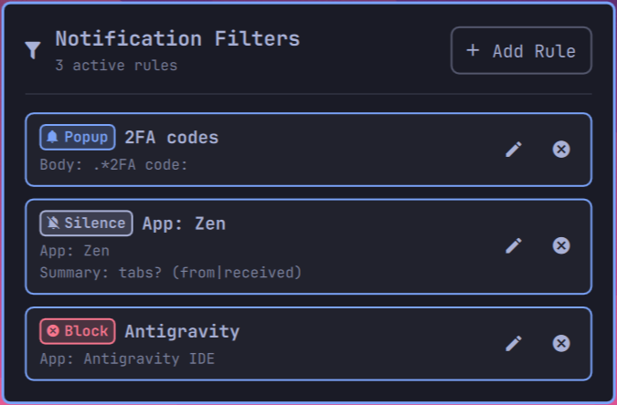

# Notification Filters

A drop-in wrapper around Omarchy's vanilla notification daemon (`omarchy.notifications`) with an interactive filter manager: intercept desktop notifications, match them by application or regular expressions, and suppress, silence, or prioritize toasts from the taskbar.



Keeps 100% of Omarchy's native notification behavior and D-Bus integration, wrapping the built-in service with real-time rule evaluation and a dedicated configuration panel.

## Features

- **Popup**: Forces the notification toast to always appear on screen, even when Do Not Disturb (DND) is active _(ideal for 2FA verification codes, critical alarms)_.
- **Silence**: Suppresses the on-screen toast popup while saving the notification into history so you can review it later without interruption.
- **Block**: Drops the notification completely—no toast popup and not recorded in history.
- **Interactive Bar Panel**: Add, edit, test, and delete rules directly from the taskbar popup panel.
- **Live Reactive Filtering**: Filter rules are saved to state storage and reloaded instantly by the background daemon without restarting the shell.
- **Top-to-Bottom Precedence**: Rules are evaluated in order; newly added rules appear at the top and take precedence.

## Install

```bash
omarchy plugin add https://github.com/Psychosoc1al/omarchy-filter-notifications.git --enable
```

## Usage

- **Click the filter icon** on your taskbar to open the filter manager panel.
- Click **+ Add Rule** to create a new filter rule.
- Click the edit icon on any rule to edit its matching conditions or action.
- Click the delete button on any rule to remove it.

## Filter Matching Rules

Each rule matches against one or more conditions using case-insensitive substring or regex matching:

| Field        | Description                                                                               | Example                                                   |
| :----------- | :---------------------------------------------------------------------------------------- | :-------------------------------------------------------- |
| **App Name** | Matches application display name or icon identifier (case-insensitive substring or regex) | `Spotify`, `Zen`, `Antigravity IDE`, `^steam_app_.*`      |
| **Summary**  | Matches notification title text (case-insensitive substring or regex)                     | `.*Daily Standup.*`, `tabs? (from\|received)`, `^Playing` |
| **Body**     | Matches message content (case-insensitive substring or regex)                             | `.*2FA code:`, `.*verification code.*`, `[0-9]{6}`        |
| **Urgency**  | Matches notification priority level                                                       | `any`, `low`, `normal`, `critical`                        |

## Storage & Configuration

Filter rules are persisted as a JSON array under your user state directory:

```text
~/.local/state/omarchy/filter.notifications/filters.json
```

Example configuration:

```json
[
  {
    "description": "2FA codes",
    "body": ".*2FA code:",
    "action": "popup"
  },
  {
    "description": "App: Zen",
    "app": "Zen",
    "summary": "tabs? (from|received)",
    "action": "silence"
  },
  {
    "description": "Antigravity",
    "app": "Antigravity IDE",
    "action": "block"
  },
  {
    "description": "Silence Spotify playback toasts into history",
    "app": "Spotify",
    "action": "silence"
  }
]
```

## Requirements

- Omarchy Quattro with third-party shell plugin support.

## Remove

```bash
omarchy plugin remove filter.notifications
```

## License

MIT — see [LICENSE](LICENSE)
